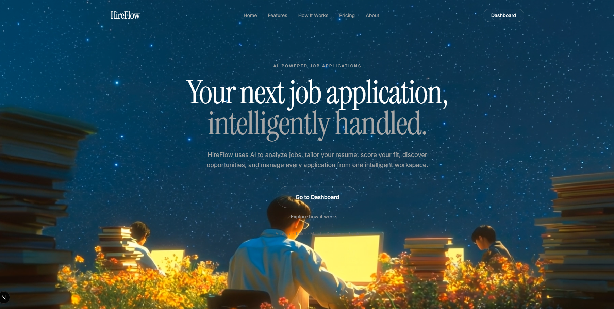
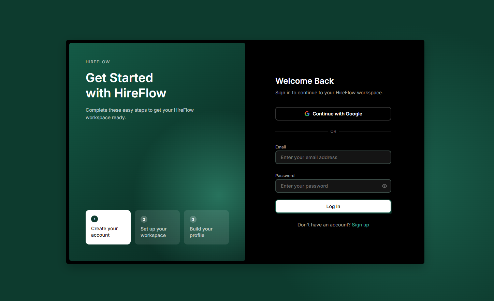
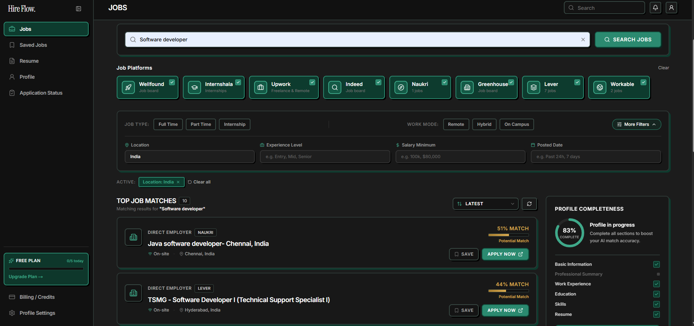
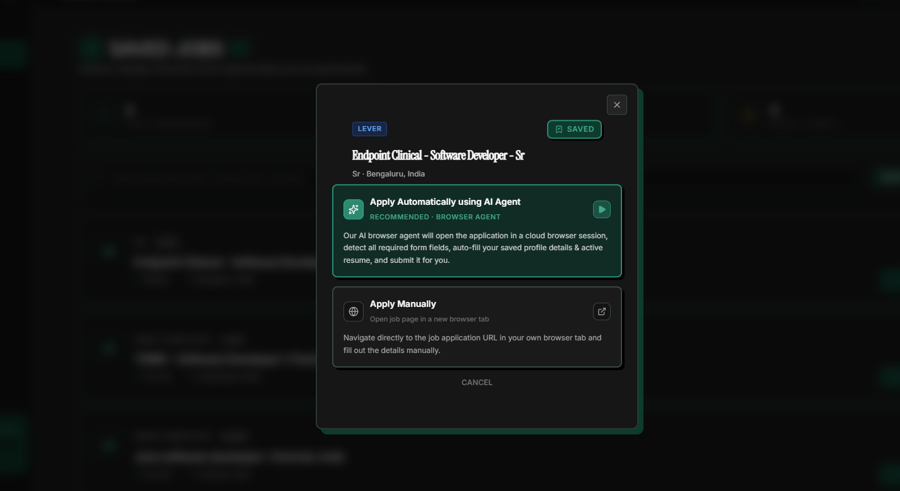
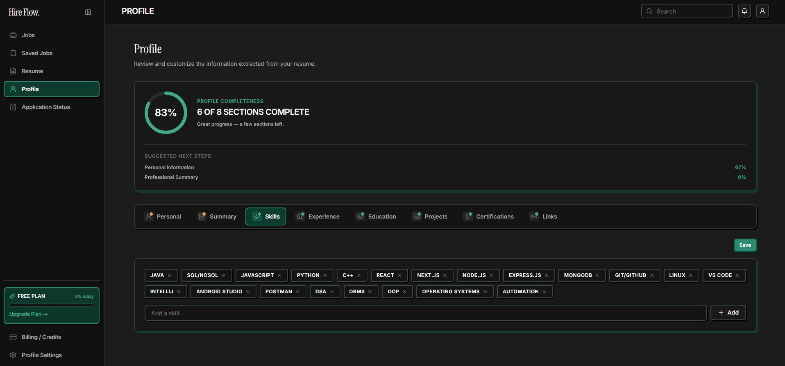
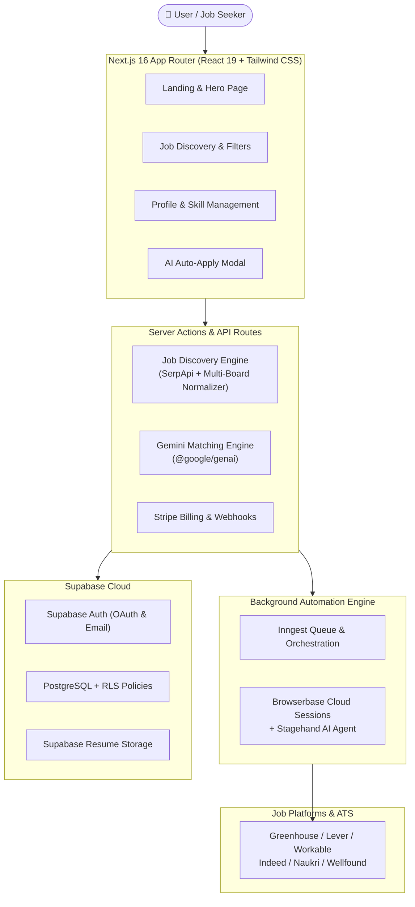

<div align="center">

# ⚡ HireFlow

### **AI-Powered Autonomous Job Application & Discovery SaaS**

*Your next job application, intelligently handled.*

<br/>

[](https://nextjs.org/)
[](https://react.dev/)
[](https://www.typescriptlang.org/)
[](https://tailwindcss.com/)
[](https://supabase.com/)
[](https://ai.google.dev/)
[](https://browserbase.com/)
[](https://www.inngest.com/)
[](https://stripe.com/)

<br/>

[Features](#-key-features) • [Tech Stack](#-tech-stack) • [Architecture](#-system-architecture) • [Getting Started](#-getting-started) • [Environment Setup](#-environment-variables) • [Screenshots](#-preview--screenshots)

</div>

---

## 📖 Overview

**HireFlow** is a modern, full-stack AI SaaS platform that supercharges your career search. It continuously discovers high-relevance job postings across top ATS platforms and job boards, evaluates candidate resume compatibility using Google Gemini AI, and autonomously fills and submits job application forms via cloud browser agents.

Stop spending hours copying and pasting details into repetitive job forms — let **HireFlow** automate your job hunt from discovery to submission.

---

## 📸 Preview & Screenshots

<div align="center">

### 🌌 Aesthetic Landing Experience
> *An inspiring, starry night hero section welcoming candidates with seamless onboarding.*

| 🚀 Hero & Value Proposition | 🔐 Modern Authentication & Onboarding |
| :---: | :---: |
|  |  |

<br/>

### 🎯 Intelligent Job Discovery & AI Matching
> *Discover opportunities across Greenhouse, Lever, Workable, Indeed, Naukri, Wellfound, Upwork, and Internshala with real-time match scoring.*



<br/>

### 🤖 Autonomous Cloud Browser Agent & Candidate Profile
> *Auto-apply with one click via Browserbase + Stagehand, and curate multi-dimensional skill profiles.*

| 🤖 AI Auto-Apply Modal | 👤 Rich Profile & Skill Completeness |
| :---: | :---: |
|  |  |

</div>

> 💡 *Note: Place your screenshot image files in `docs/screenshots/` named as `landing_hero.png`, `auth_modal.png`, `jobs_discovery.png`, `auto_apply_modal.png`, and `profile_skills.png`.*

---

## ✨ Key Features

### 🔍 1. Multi-Platform Job Aggregator & Filtering
- **Unified Job Feed**: Aggregate postings across **Lever**, **Greenhouse**, **Workable**, **Wellfound**, **Indeed**, **Naukri**, **Internshala**, and **Upwork**.
- **Granular Filters**: Filter by Job Type (*Full Time, Part Time, Internship*), Work Mode (*Remote, Hybrid, On-site*), Location, Experience Level, Minimum Salary, and Posted Recency.
- **Smart Deduplication & Cache**: Advanced query caching and normalization ensure fast, unique results.

### 🧠 2. Gemini AI Resume & Fit Matching
- **Deep Compatibility Analysis**: Evaluates match percentage between job descriptions and candidate resumes.
- **Skill Gap Detection**: Identifies matching skills and provides actionable suggestions to boost score.
- **Resume Parsing Engine**: Automatic extraction of structured experience, education, skills, and certifications from PDF and DOCX files.

### 🤖 3. Autonomous Cloud Browser Agent (Browserbase & Stagehand)
- **1-Click Auto Application**: Executes a cloud-based headless browser session using **Browserbase** and **Stagehand AI**.
- **Intelligent Form Detection**: Automatically recognizes form fields across varying ATS platforms (Lever, Greenhouse, custom job portals).
- **Safe Auto-Fill & Submission**: Safely maps candidate profile data, uploads active resume documents, answers questionnaire prompts, and verifies submissions.

### 📊 4. Interactive Profile & Resume Studio
- **Profile Completeness Tracker**: Visual progress gauge across 8 core dimensions (*Personal, Summary, Skills, Experience, Education, Projects, Certifications, Links*).
- **Interactive Skill Chips**: Add, manage, and prioritize primary tech stacks and skill keywords.
- **Multi-Resume Management**: Upload, preview, and set active resumes tailored for different target roles.

### ⚡ 5. Background Task Orchestration & SaaS Billing
- **Reliable Queues with Inngest**: Asynchronous background workflows for lengthy browser operations, retries, and job sync.
- **Stripe Subscription Management**: Flexible free & paid tier plans with credit metering and automated checkout workflows.
- **Supabase Backend**: Fast PostgreSQL database with Row-Level Security (RLS), real-time state, and secure Supabase Storage.

---

## 🏗️ System Architecture



---

## 🛠️ Tech Stack

| Domain | Technologies & Libraries |
| :--- | :--- |
| **Framework & Runtime** | [Next.js 16](https://nextjs.org/) (App Router), [React 19](https://react.dev/), [TypeScript](https://www.typescriptlang.org/) |
| **Styling & UI** | [Tailwind CSS v4](https://tailwindcss.com/), [Shadcn UI](https://ui.shadcn.com/), Lucide Icons |
| **AI & Automation** | [Google Gemini 2.0/Flash](https://ai.google.dev/), [Browserbase](https://browserbase.com/), [Stagehand](https://stagehand.dev/) |
| **Database & Auth** | [Supabase](https://supabase.com/) (PostgreSQL, Row Level Security, Auth, Storage) |
| **Job Queues & Async** | [Inngest](https://www.inngest.com/) Background Workflow Engine |
| **Payments & SaaS** | [Stripe](https://stripe.com/) Checkout & Billing Portals |
| **Document Parsing** | `pdf-parse`, `mammoth` (DOCX parser) |

---

## 📂 Project Structure

```text
hireflow/
├── app/                        # Next.js App Router
│   ├── (auth)/                 # Authentication routes (login, signup)
│   ├── api/                    # API route handlers (inngest, webhooks, stripe)
│   ├── dashboard/              # Protected SaaS Dashboard
│   │   ├── application-status/ # Applied job tracking & status updates
│   │   ├── billing/            # Stripe subscription & credit usage
│   │   ├── jobs/               # Aggregated job search & filters
│   │   ├── profile/            # Profile editor & skill management
│   │   ├── resume/             # Resume upload & parser view
│   │   ├── saved-jobs/         # Bookmarked jobs & auto-apply launcher
│   │   └── settings/           # User preferences & account settings
│   └── page.tsx                # Stunning landing page
├── components/                 # Reusable UI & Feature components
│   ├── jobs/                   # Job cards, search filters, modal dialogs
│   ├── profile/                # Skill tags, completeness gauge, section forms
│   └── ui/                     # Accessible UI components (Shadcn / Base UI)
├── docs/
│   └── screenshots/            # Repository documentation images & screenshots
├── lib/                        # Core backend libraries & utilities
│   ├── browserbase/            # Browserbase & Stagehand AI browser automation
│   ├── inngest/                # Inngest function handlers & event triggers
│   ├── jobs/                   # Job scraping, normalization, matching, SerpAPI
│   ├── resume-parser/          # PDF & DOCX text extraction
│   ├── stripe/                 # Stripe SDK clients & webhook helpers
│   └── supabase/               # Server & Client Supabase configurations
└── supabase/
    └── migrations/             # SQL database schema and migration scripts
```

---

## 🚀 Getting Started

### 1. Clone the Repository

```bash
git clone https://github.com/saptarshidey3000/HireFlow-AI-Job-Application-Agent-SaaS-.git
cd HireFlow-AI-Job-Application-Agent-SaaS-
```

### 2. Install Dependencies

```bash
npm install
```

### 3. Configure Environment Variables

Create a `.env.local` file in the root directory:

```bash
cp .env.example .env.local
```

Fill in the required credentials:

```ini
# Supabase Configuration
NEXT_PUBLIC_SUPABASE_URL=your_supabase_project_url
NEXT_PUBLIC_SUPABASE_PUBLISHABLE_KEY=your_supabase_publishable_key
SUPABASE_SERVICE_ROLE_KEY=your_supabase_service_role_key

# Google Gemini API
GEMINI_API_KEY=your_gemini_api_key

# SerpApi (for Job Discovery)
SERPAPI_API_KEY=your_serpapi_api_key

# Browserbase & Stagehand (Cloud AI Browser Agent)
BROWSERBASE_API_KEY=your_browserbase_api_key
BROWSERBASE_PROJECT_ID=your_browserbase_project_id

# Inngest Background Functions
INNGEST_DEV=1
INNGEST_EVENT_KEY=your_inngest_event_key
INNGEST_SIGNING_KEY=your_inngest_signing_key

# Stripe Billing & Checkout
STRIPE_SECRET_KEY=sk_test_...
NEXT_PUBLIC_STRIPE_PUBLISHABLE_KEY=pk_test_...
STRIPE_WEBHOOK_SECRET=whsec_...

# Base URLs
NEXT_PUBLIC_SITE_URL=http://localhost:3000
NEXT_PUBLIC_APP_URL=http://localhost:3000
```

### 4. Setup Database Schema

Run the SQL migration files located in `supabase/migrations/` inside your Supabase SQL Editor.

### 5. Run the Local Development Server

Start both the Next.js development server and the Inngest local development server:

```bash
# Terminal 1: Start Next.js App
npm run dev

# Terminal 2: Start Inngest Background Dev Server
npm run inngest:dev
```

Open [http://localhost:3000](http://localhost:3000) in your browser.

---

## 🤖 How the AI Auto-Apply Agent Works

```text
1. Select Job Posting ➔ 2. Click 'Apply Automatically' ➔ 3. Trigger Inngest Event
                              │
                              ▼
           4. Spawn Browserbase Cloud Browser Session
                              │
                              ▼
           5. Stagehand AI Navigates & Analyzes Application DOM
                              │
                              ▼
           6. Map Profile Attributes (Contact, Experience, Skills)
                              │
                              ▼
           7. Upload Resume PDF & Answer Custom Questions
                              │
                              ▼
           8. Verify Form Submission & Update Status in Supabase
```

---

## 🗺️ Roadmap

- [x] Multi-board real-time job aggregation
- [x] Google Gemini AI resume scoring & fit analysis
- [x] Cloud browser automation via Browserbase + Stagehand
- [x] Interactive skill profiling & resume parsing
- [x] Stripe subscription tiers & credit usage limits
- [ ] Email notifications on application status changes
- [ ] Chrome Extension for 1-click apply directly on external job boards
- [ ] Multi-language resume localization

---

## 🤝 Contributing

Contributions are welcome! Please feel free to submit a Pull Request.

1. Fork the repository
2. Create your Feature Branch (`git checkout -b feature/AmazingFeature`)
3. Commit your Changes (`git commit -m 'Add some AmazingFeature'`)
4. Push to the Branch (`git push origin feature/AmazingFeature`)
5. Open a Pull Request

---

## 📄 License

This project is licensed under the MIT License - see the [LICENSE](LICENSE) file for details.

---

<div align="center">

Made with ❤️ by [Saptarshi Dey](https://github.com/saptarshidey3000)

**Star ⭐ this repo if you find it helpful!**

</div>
